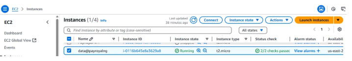
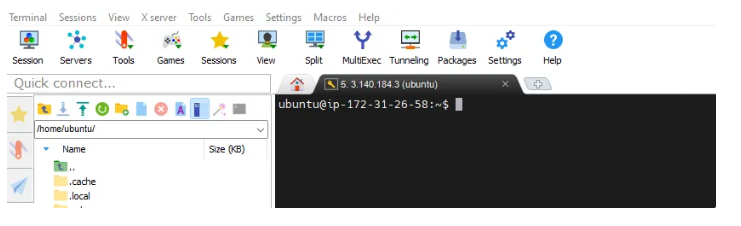
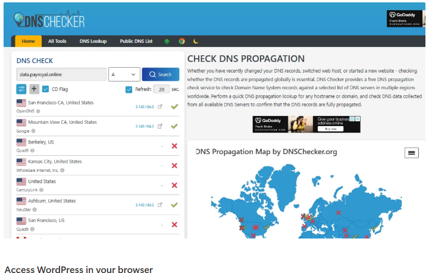
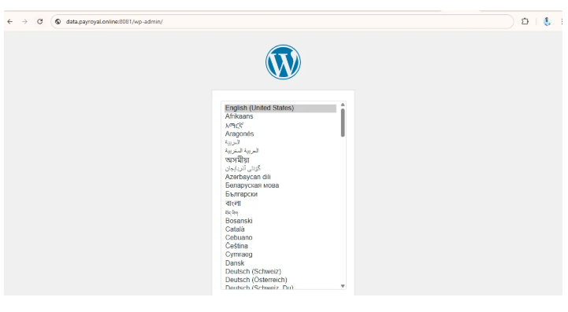
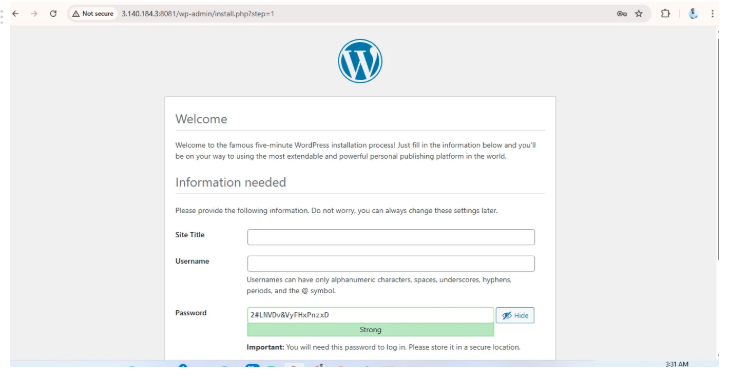

### How i Deployed a Dynamic Sub-domain website for a Client - PayRoyal Using bash Scripting

## Creation of a Virtual Machine in AWS** 



## Login to the server using mobaXterm through ssh-key



##Carefully Write out the Bash Script and Create the script file using 

```
nano deploy-data@payroyal.sh

```

```
#!/bin/bash

# Update system and install Docker & Docker Compose
sudo apt update -y 
sudo apt install docker.io docker-compose -y

# Create directories for MySQL configuration
mkdir -p mysql/{data,initdb,config}

# Create SQL initialization script
cat <<EOF > mysql/initdb/grant-all.sql
CREATE USER 'vincent2020'@'%' IDENTIFIED BY 'vincent@2020';
GRANT ALL PRIVILEGES ON *.* TO 'vincent2020'@'%' WITH GRANT OPTION;
CREATE USER 'wordpress'@'%' IDENTIFIED BY 'Wordpress@2020';
GRANT ALL PRIVILEGES ON *.* TO 'wordpress'@'%' WITH GRANT OPTION;
CREATE DATABASE royalpaydb;
FLUSH PRIVILEGES;
EOF

# Create MySQL config file
cat <<EOF > mysql/config/mysqld.cnf
[mysqld]
user = mysql
port = 3306
datadir = /var/lib/mysql
bind-address = 0.0.0.0
mysqlx-bind-address = 0.0.0.0
key_buffer_size = 16M
myisam-recover-options = BACKUP
general_log_file = /var/log/mysql/query.log
general_log = 1
log_error = /var/log/mysql/error.log
max_binlog_size = 100M
EOF

# Create docker-compose file
cat <<EOF > mysql/docker-compose.yaml
version: '3.8'
services:
  mysql:
    image: mysql:latest
    container_name: mysql-container
    restart: unless-stopped
    environment:
      MYSQL_ROOT_PASSWORD: Vincent2020
      MYSQL_DATABASE: royalpaydb
      MYSQL_USER: wordpress
      MYSQL_PASSWORD: Wordpress@2020
    ports:
      - "3306:3306"
    volumes:
      - ./config:/etc/mysql/conf.d
      - ./data:/var/lib/mysql
      - ./initdb:/docker-entrypoint-initdb.d
    networks:
      - wp-net

  wordpress:
    image: wordpress:latest
    container_name: wordpress
    restart: unless-stopped
    depends_on:
      - mysql
    ports:
      - "8081:80"
    environment:
      WORDPRESS_DB_HOST: mysql-container:3306
      WORDPRESS_DB_USER: wordpress
      WORDPRESS_DB_PASSWORD: Wordpress@2020
      WORDPRESS_DB_NAME: royalpaydb
    networks:
      - wp-net

networks:
  wp-net:
    driver: bridge
EOF

# Move into the mysql directory to run docker-compose
cd mysql
sudo docker-compose up -d

```


## Inspect the file using 

```
cat deploy-data@payroyal.sh  
```

## Then deploy using 

```
sh deploy-data@payroyal.sh

```
 

## Confirm the Containers are running 


## Connect to Domain using Advance DNS Settings*


 
## Confirm it has been Propagated using

[dnschecker.org](http://dnschecker.org)** 



## Access WordPress in your browser**

http://SERVERIP:8081

[http://data.payroyal.online:8081](http://data.payroyal.online:8081/wp-admin/)



## Then Continue with the setups**


